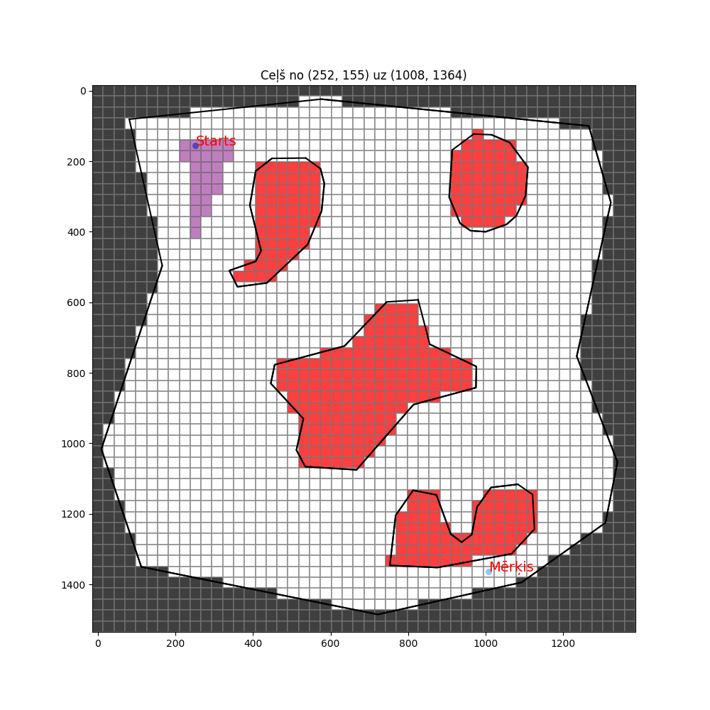
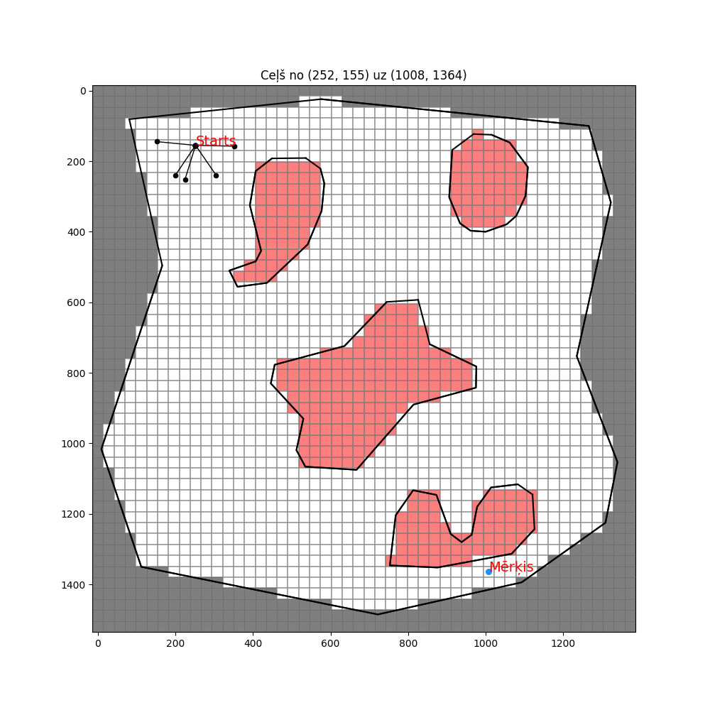
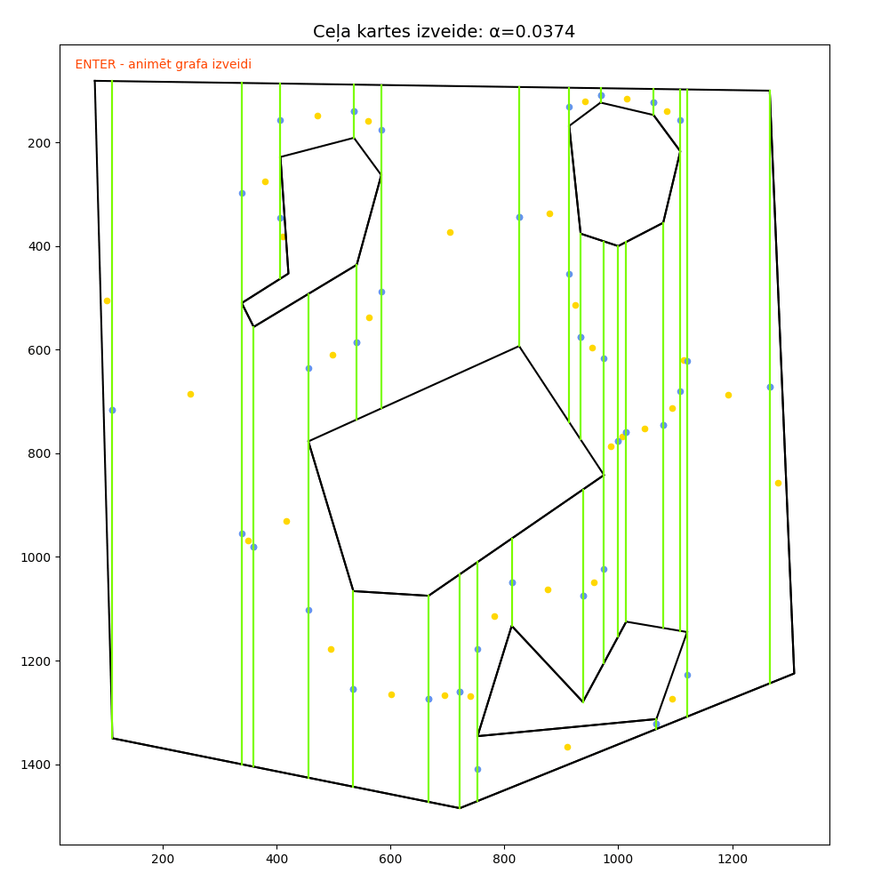
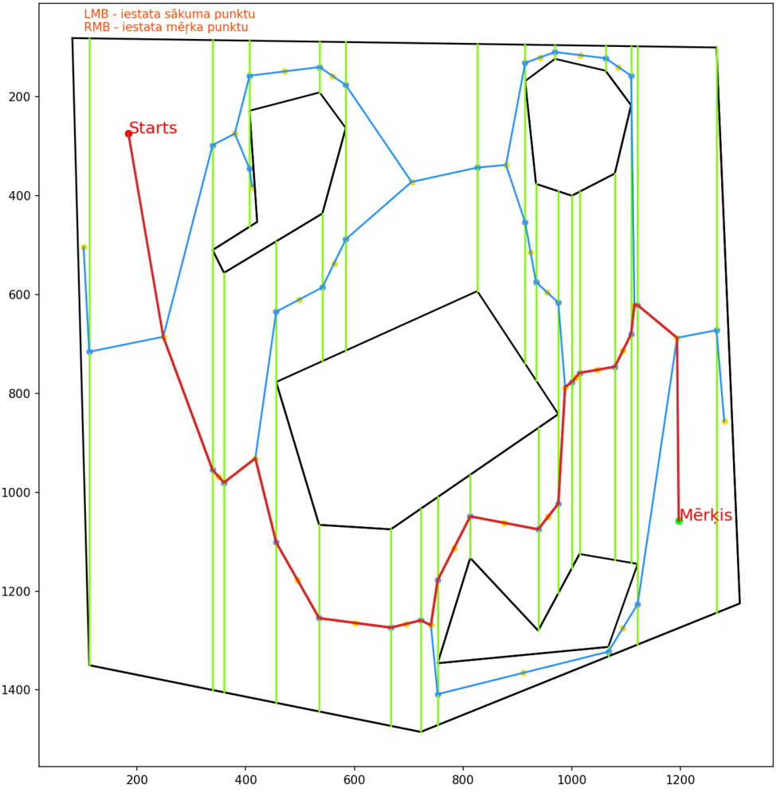

# Kursa "Intelektuālu robotu darbību plānošana" noslēguma darba programmas

# Kontūru aproksimācija
### contour_estimator.py

Darbināt ar
```
python ./contour_estimator.py --input ./demo/2D_map.png --alpha 0.005 -d -v --overwrite_json
```
Argumenti:

```--input```, ```-i``` - obligāts arguments - norāde uz attēlu (2D karti);

```--output```, ```-o``` - norāde uz izejas failu atrašanās vietu;

```--overwrite_json```, ```-j``` - pārrakstīt JSON failu;

```--alpha```, ```-a``` - parametrs α nosaka aproksimācijas precizitāti. Noklusējumā α=0.01;

```--draw```, ```-d``` - vizualizēt rezultātu (automātiski, ja nav norādīts ```output```);

```--verbose```, ```-v``` - izvadīt papildus informāciju.

# Diskrētā plānošana
### discrete_planner.py

Darbināt ar
```
python discrete_planner.py --input ./demo/2D_map.png --algorithm A* --start 237 416 --goal 934 1250 --grid_cols 80 --grid_rows 70 -v -d --animate
```
```
python discrete_planner.py --input ./demo/2D_map.png --algorithm RRT --start 237 416 --goal 934 1250 -v -d --seed 1234 --animate
```
```
python discrete_planner.py --input ./demo/2D_map.png --algorithm WF --goal 1000 1000 -v -d --animate
```

Argumenti:

```--input```, ```-i``` - obligāts arguments - norāde uz attēlu (2D karti);

```--start```, ```-s``` - obilgāts arguments - sākuma punkta X Y;

```--goal```, ```-g``` - obilgāts arguments - mērķa punkta X Y;

```--algorithm``` - obligāts arguments - algoritms (A*, RRT vai WF);

```--seed``` - norādīt nejauši ģenerēto skaitļu sēklu;

```--animate``` - animē rezultātus

```--grid_cols``` - režģa kolonu skaits (noklusējums=50);

```--grid_rows``` - režģa rindu skaits (noklusējums=50);

```--alpha```, ```-a``` - parametrs α nosaka aproksimācijas precizitāti. Noklusējumā α=0.01;

```--verbose```, ```-v``` - izvadīt papildus informāciju.

```--draw```, ```-d``` - vizualizēt rezultātu (automātiski, ja norādīts ```animate```);


| A* algoritma piemērs      | RRT algoritma piemērs | 
|---------------------------|---------------------------|
|  |  |
| <b>Viļņu frontes algoritma piemērs<b> |
  |


# Vertikālā dekompozīcija
### vertical_decomposition.py

Lai veiktu vertikālu dekompozīciju, darbināt ar
```
python vertical_decomposition.py --input ./demo/2D_map.png --output ./demo/vertical_decomposition --alpha 0.0374 -v
```
Lai ielādētu vertikālās dekompozīcijas failu, darbināt ar
```
python vertical_decomposition.py --input ./demo/2D_map.png --load_data ./demo/2D_map_cells.txt --alpha 0.0374 -v
```

```--input```, ```-i``` - obligāts arguments - norāde uz attēlu (2D karti);

```--load_data```, ```-l``` - ja iepriekš jau veikta vertikālā dekompozīcija, ar šo ielādē rezultāta failu;

```--alpha```, ```-a``` - parametrs α nosaka aproksimācijas precizitāti. Noklusējumā α=0.01;

```--output```, ```-o``` - norāde, kurā mapē glabāt vertikālās dekompozīcijas failu;

```--verbose```, ```-v``` - izvadīt papildus informāciju.

| Vertikālās dekompozīcijas piemērs | Sākuma un mērķa punkts |
|-----------------------------------|------------------------|
|  |  |